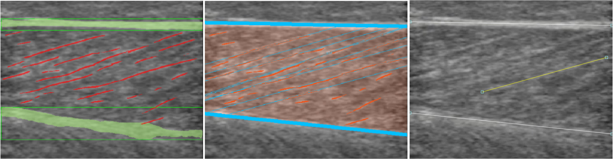

# SMG-master

## A software for Automatic Analysis of Skeletal Muscle Using Portable Ultrasound and Multiple Biosensors

Zhen Song, Vaheh Nazari, Shuai Li, Yuyan Luo, Yihao Zhou, Christina Zong-Hao Ma, Yongping Zheng

(Department of Biomedical Engineering, The Hong Kong Polytechnic University, Hong Kong, China)
(The Research Institute for Smart Ageing, The Hong Kong Polytechnic University, Hong Kong, China)

Below are the official implementation of ***SMG-master***, which ***will be avaliable after the relevant paper is published***.

## Table of contents

* [Real-time demo](#demo)
* [Overview](#overview)
* [Getting started](#getting-started)
* [Use the GUI](#use-the-gui)
* [Data format](#data-format)
* [Methodology](#methodology)

## Demo

- Automated processing and analysis using SMG-master:

https://github.com/user-attachments/assets/8a398ecf-6108-43fc-ae3f-6d3193e0fe27

- User-friendly review and manual adjustment:

https://github.com/user-attachments/assets/1544f121-6284-47ba-9c71-37a8c1510f53

## Overview

<div align=center></div>

**Version 1.0** of **SMG-master** was developed based on open-source libraries OpenCV, PyQt and PyQtGraph, integrating advanced algorithms and user-friendly features for real-time and post-analysis of skeletal muscle. The graphical user interface (GUI), includes a toolbar for main functions, a frame selection slider, two viewers for ultrasound images and signals, and a status bar for information and control.

* Users can [load their own video data](#getting-started).
* Software produce data in a easy-to-manage [directory and format](#data-format).
* Generate ROIs and initial masks [automatically](#methodology) or manually.
* [Real-tmie visulize](#demo) segmented videos, multiple bio-signals and SMG signals.
* Multiple strategies for [processing](#methodology) and [structure visualization](#use-the-gui).
* Use [Control line](#use-the-gui) to easily correct the poor results.

## Getting started

The basic workflow comprises four key steps, detailed in our repository

* **Loading data:** Users can load pre-captured data or connect wirelessly to wearable monitoring equipment for real-time data. Supported formats for loading images and videos include **JPEG**, **PNG**, **MP4**, and **AVI** supported by OpenCV.
* **Presetting:** Users set essential parameters before running the image processing algorithm. This includes establishing a conversion between actual distance and image pixels using the **“Set image depth”** or **“Calibrate distance”** functions. The **“ROI setting”** function allows batch cropping and initial mask M_0 can be drawn for tracking algorithms via the **“Tracking ROI setting”** function. Hyperparameters can be configured through **“Advanced settings”**.
* **Runing algorithm:** Once all settings are ready the users run the muscle recognition and post-processing algorithm by clicking the **“Start / Pause process”** button. The software supports one-frame processing with the **“Forward one frame”** function, displaying processed images and SMG features alongside other signals.
* **Manually adjusting and exporting:** Users can manually adjust incorrectly reconstructed structures by dragging control lines. Adjustments simultaneously recalculate SMG features, with the option **“Create control line”** to draw control lines if tracking is lost in certain frames. The **“Export”** function saves or overwrites an n×15 array of data, including frame index, timestamps, five SMG features, and eight sensor signals in an Excel format for better readability.

### Environment configuration for GPU inference

* Avaliable after the relevant paper is published.

## Use the GUI

1. To ensure the GPU inference otherwise default to CPU inference:

```Bash
Conda activate env_name
SMG-master.exe
```

2. Choose processing strategy:

User can choose segmentation or tracking for borders, and select individual fascicle segmentation or full-region orienation estimation for fascicle.

<div style="display: flex; justify-content: space-around;">
    
    
</div>

3. Choose visualization mode:

User can choose to review the **Segmentation results**/**post-processing results**/**Control line**


4. Drag sliderbar to review all results.
5. Drag control line to adjust poor results.

## Data format

- Videos are expected to use .avi or .mp4 format.
- Prepared and resulted files are preferred to organize as follows (Taken [demo0](demo0) as an example name):

```bash
demo0
├── demo0.mp4                // ultrasound video
└── demo0.xls             // bio-singal and exported data
```

## Methodology

Avaliable after the relevant paper is published

## Citing

Not applicable

## Contact

[zhen0212.song@connect.polyu.hk](mailto:zhen0212.song@connect.polyu.hk)
